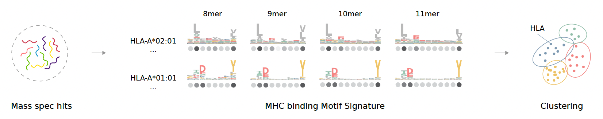

# MMS clustering README

# **MMS Clustering**

This folder contains the code, data, and models for the **MHC Motif Signature (MMS) Clustering** module, which serves as a key sub-component of the ImmunoMTL framework.


The goal of this module is to define, calculate, and cluster MHC alleles based on their peptide motif preferences.

## **Overview**

The pipeline works as follows:

1. Data Preparation
2. Feature Extraction (MMS scoring)
3. Unsupervised Clustering (compare KMeans and GMM)
4. Evaluation and Visualization
5. Additional analysis comparing with the pseudo-sequence-based method

This clustering allows the multi-task learning (MTL) model to share information across similar MHC alleles during immunogenicity prediction.

**Folder Structure**

```php
MMS_clustering/
├── analysis/              → Jupyter notebooks for exploratory analysis & visualization
├── data/                  → Input data (raw data should be downloaded by the user; sources are noted in each script in the src folder)
├── models/                → Trained KMeans and GMM clustering models
├── results/               → Clustering outputs, evaluation scores, visualization results
├── src/                   → Source Python scripts for data prep, clustering, validation
```

**Key Scripts**

| **File** | **Description** |
| --- | --- |
| src/MHCflurry_data_prep.py | Compute MMS scores for all MHC alleles based on peptide motifs |
| src/KMeans.py | Apply KMeans clustering to MMS feature matrix |
| src/gmm_clustering.py | Apply Gaussian Mixture Model (GMM) clustering |
| src/t2_MMScluster_assign.py | Assign less confidence alleles to clusters |
| src/validation.py | Evaluate clustering performance vs. MHC Motif Atlas |
| analysis/Evl_viz.ipynb | Visualize evaluation |
| analysis/Pseudo_sequencing.ipynb | Pseudo sequence analysis |

